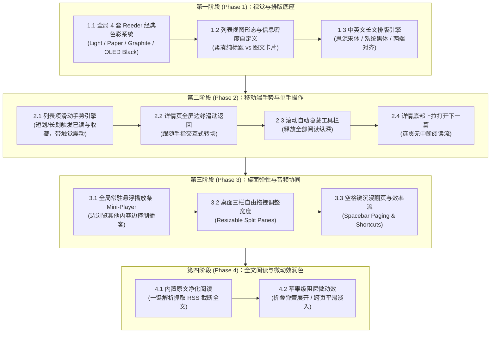

# 深度借鉴 Reeder 5：读了么（WReader）UI/UX 分阶段重塑计划

最后更新：2026-10-01  
产品代号：读了么 (WReader)  
对标标杆：Reeder 5 (by Silvio Rizzi)

---

## 1. 核心设计哲学拆解 (Reeder 5 核心质感)

[Reeder 5](https://reeder.app) 被公认为 Apple 生态中界面美学、交互触感与阅读沉浸感的标杆产品。其核心设计魅力体现在以下四个维度：

1. **统一温润的色彩与材质系统（Full-Surface Themes）**：
   暗黑/羊皮纸不仅仅是正文背景，而是从侧边栏、列表项、分割线到弹窗的全界面深度浸润，层次分明且无视觉杂色。
2. **直觉物理手势驱动（Physics-based Gestures）**：
   在移动端彻底告别点选按钮，通过列表横划标记、边缘手势返回、底部上拉切篇等触控手势，实现单手闭环。
3. **呼吸感的沉浸阅读（Bar Hiding & Clean Typography）**：
   滚动正文时界面控件无感淡出，中英文排版极其讲究（行距、字阶、字重、两端对齐、衬线字体）。
4. **弹性视窗与密度自选（Flexible Density & Layout）**：
   用户可在“紧凑无图纯标题”与“图文杂志”间一键切换，摘要行数、缩略图可见性均可自由调校。

---

## 2. 阶段规划总览与时间线

| 阶段 | 核心主题 | 计划周期 | 关键交付物 |
| :--- | :--- | :--- | :--- |
| **Phase 1** | **视觉底座与排版系统升级** | 1~2 周 | 全局 4 套 Reeder 主题、紧凑纯标题/图文视图切换、中英文长文排版引擎（宋体/黑体） |
| **Phase 2** | **移动端全套触控手势与沉浸交互** | 1~2 周 | 列表项滑动手势（已读/收藏）、详情边缘滑动返回、滚动自动隐藏顶底栏、底部上拉切篇 |
| **Phase 3** | **桌面端工作区弹性与全局音频体验** | 1 周 | 常驻 Mini-Player 悬浮播放条（边听边读）、桌面三栏自由拖拽调宽、空格键翻页流 |
| **Phase 4** | **全文阅读净化与 Apple 级微动效** | 1 周 | 内置网页全文提取器（Readability/Mercury）、页面切换与浮层微动效 |

---

## 3. 详细实施方案

### 第一阶段（Phase 1）：视觉底座与排版系统升级

#### 1.1 全局 4 套经典主题（Global Surface Themes）
* **现状痛点**：目前切换 Dark/Paper 只改变 `#article-reader` 正文容器，外层的导航和列表依然是亮色，夜晚刺眼且断层严重。
* **Reeder 做法**：整套 App 全局应用一致的色板基准。
* **实施方案**：
  1. 将主题属性从 `#article-reader` 移至根节点 `<html data-theme="...">`。
  2. 建立四套 CSS 变量体系：
     * **Light（纯净白）**：背景 `#FFFFFF`，列表 `#F8F9FA`，边框 `#E5E7EB`，文字 `#1E293B`。
     * **Paper / Sepia（暖黄纸质）**：背景 `#F7F2E7`，列表 `#EFE9DC`，边框 `#E3DAC9`，文字 `#2D2820`。
     * **Dark / Graphite（石墨深灰，Reeder 经典默认暗色）**：背景 `#1E2022`，列表 `#161719`，边框 `#2C2F33`，文字 `#E2E8F0`。
     * **Black / OLED（纯黑高对比）**：背景 `#000000`，列表 `#0A0A0A`，边框 `#1C1C1E`，文字 `#F8FAFC`。
  3. 全局重构 `Sidebar`、`Header`、`ArticleList`、`Modal` 及滚动条样式，支持随系统主题（System Auto）自动跟随。

#### 1.2 列表视图形态与信息密度自定义（List Density Controls）
* **现状痛点**：列表强制显示 40×40 缩略图 + 2 行标题 + 1 行摘要，浏览大量新闻源时坪效过低。
* **Reeder 做法**：
  * 支持自由切换：**紧凑列表（Compact / Titles Only）** vs **图文卡片（Cards / Rich Preview）**；
  * 支持自定义摘要行数：0 行（不显示）、1 行、2 行。
* **实施方案**：
  1. 在 `Header.tsx` 增加视图切换菜单（或在设置中提供选项），持久化在本地。
  2. **紧凑纯标题模式（Compact）**：
     * 行高固定为 38px，取消图片与正文摘要；
     * 左侧渲染 14px 源 Favicon + 未读小圆点，中间单行截断标题，右侧浅灰色紧凑时间；
     * 单屏文章可见数量从 8~10 篇提升至 20~25 篇。
  3. **摘要行数可调**：在现有图文列表中支持 `lineClamp: 0 | 1 | 2` 配置。

#### 1.3 中英文长文排版引擎（Typography & Readability）
* **现状痛点**：仅能微调字号和两档行高，字体强制使用系统无衬线黑体，缺少人文社科长文所需的宋体质感。
* **Reeder 做法**：提供经典衬线（Serif）与无衬线（Sans-Serif）字体选择，优化字重与段落呼吸感。
* **实施方案**：
  1. 在详情页设置抽屉中增加**“字体家族（Font Family）”**选项：
     * **系统黑体（无衬线 / 默认）**：`-apple-system, "SF Pro Text", "PingFang SC", sans-serif`
     * **人文宋体（衬线体 / 适合散文特稿）**：`"Songti SC", "Noto Serif SC", "Source Han Serif SC", STSong, serif`
     * **等宽阅读（针对技术代码/播客逐字稿）**：`ui-monospace, "SF Mono", Menlo, monospace`
  2. 启用中西文混排规范：增加两端对齐 `text-align: justify; text-justify: inter-ideograph;`，微调行间距与段落边距（段间距设为 `1.4em`，首行段落呼吸感）。

---

### 第二阶段（Phase 2）：移动端全套触控手势与沉浸交互

#### 2.1 列表项滑动手势引擎（Swipe Actions）
* **Reeder 交互规范**：
  * **向右短划（Right Short Swipe）**：露出绿色背景与对勾图标，松手触发**“标记已读 / 标记未读”**；
  * **向右长划（Right Long Swipe）**：震动一次并变为全部已读；
  * **向左短划（Left Short Swipe）**：露出黄色背景与星标，松手触发**“收藏 / 取消收藏”**；
  * **向左长划（Left Long Swipe）**：加入播客播放队列。
* **实施方案**：
  1. 为 `ArticleList` 行组件集成基于 Pointer / Touch 事件的平滑位移与弹性吸附算法（阻尼系数 0.6）。
  2. 达到阈值时触发微震动反馈（调用现代 Web API `navigator.vibrate?.(10)`），赋予原生实体质感。
  3. 滑动取消或回弹时使用贝塞尔曲线动画（`cubic-bezier(0.2, 0.8, 0.2, 1)`）。

#### 2.2 详情页全屏边缘滑动返回（Interactive Edge Swipe Back）
* **现状痛点**：进入详情后必须点击左上角的小箭头按钮才能返回，大屏单手极不便。
* **Reeder 做法**：从屏幕左侧边缘（0~30px 区域）向右划动，详情页面随手指同比例平滑向右位移并露出底层列表，划过 30% 屏幕宽度后松手即返回。
* **实施方案**：
  1. 监听详情页视窗左侧的 `touchstart` / `touchmove` / `touchend`。
  2. 实现交互式转场（Interactive Transition）：列表层跟随有轻微的缩放（0.96 -> 1.0）和渐变暗影层（Mask Dimming），滑动取消时自动吸附弹回，松手且速度够快时退出详情。

#### 2.3 自动隐藏工具栏（Scroll-to-hide Bars）
* **Reeder 做法**：
  * 列表和正文向下滚动时，顶部导航栏和底部 Tab 栏平滑向上/向下隐藏，释放全部垂直空间；
  * 向上滚动或轻触屏幕上部时，工具栏立即优雅滑出；
  * 滚动到页面最底部时自动显出。
* **实施方案**：
  1. 封装一个轻量滚动方向感知 Hook（`useScrollDirection`），带有 20px 的滑动防抖与判定阈值。
  2. 配合 CSS `translateY` 变换与 `transition: transform 0.25s cubic-bezier(0.16, 1, 0.3, 1)`。

#### 2.4 详情底部“上拉打开下一篇（Pull up for Next Article）”
* **Reeder 标志性神级交互**：读完长文滑到最底部后，继续向上拉动一段距离，底部露出“松开打开下一篇未读”，手指松开直接无缝切换到下一篇文章。
* **实施方案**：
  1. 监听详情主滚动容器到达底部（`scrollTop + clientHeight >= scrollHeight - 5`）后的持续向上拖拽。
  2. 底部渲染一个带箭头旋转动效的提示胶囊，拉动距离超过 60px 时触发触觉反馈并加载 `nextArticle`。

---

### 第三阶段（Phase 3）：桌面端工作区弹性与全局音频体验

#### 3.1 全局常驻悬浮播放条（Floating Mini-Player）
* **现状痛点**：在详情页点击播放播客后，一旦退回列表或看其他文章，播客控制器完全消失，想暂停或快进必须重新找到原文章。
* **Reeder 5 / 播客类 App 做法**：音频一旦开始播放，无论路由切换到哪个页面，界面右下角或底部始终常驻一个小巧精致的播放胶囊。
* **实施方案**：
  1. 在 `App.tsx` 最顶层挂载常驻悬浮 Mini-Player 组件，仅在 `audioPlayer.currentTrack` 激活时浮现。
  2. 桌面端形态：位于屏幕右下角（或中栏底部），高 48px，毛玻璃背景；
     * 包含：32px 播客封面、单行滚动标题、15s快退、播放/暂停、倍速菜单、细线进度条；
     * 点击封面或标题直接弹开/跳转到对应的播客详情或逐字稿。
  3. 移动端形态：吸附在移动端底部导航栏正上方，高 44px，滑动切歌或暂停。

#### 3.2 桌面三栏宽度自由拖拽调整（Resizable Split Panes）
* **现状痛点**：左栏固定 228px，列表固定 342px，正文最大 650px，高分屏无法调整。
* **实施方案**：
  1. 在左栏与中栏、中栏与右栏之间引入 4px 的不可见悬停拖拽把手（Drag Handle），光标变为 `col-resize`。
  2. 拖拽支持最小/最大保护（如左栏 180px~320px，中栏 280px~500px）。
  3. 用户的自定义宽度实时持久化到 IndexedDB / LocalStorage。

#### 3.3 经典键盘效率流拓展（Spacebar Paging & Shortcuts）
* **Reeder 经典快捷键对标**：
  * **空格键（Space）**：未到底时向下滚动一屏；到底时直接打开下一篇未读（阅读极其爽快）；
  * **Shift + 空格**：向上滚动一屏；
  * **回车键（Enter）**：在列表中直接在新标签页打开文章原文；
  * **Cmd / Ctrl + K**：呼出快速跳转命令板。

---

### 第四阶段（Phase 4）：全文阅读净化与 Apple 级微动效

#### 4.1 内置原文净化阅读（Mercury / Readability Full-Text Parsing）
* **Reeder 标配功能**：大量 RSS 源只输出前言摘要或截断内容，Reeder 详情顶部提供一个“阅读器切换”开关，点击直接抓取正文排版呈现。
* **实施方案**：
  1. 依托现有本地服务端能力（`server/services`），引入类似 Mozilla Readability 的正文提取器。
  2. 在详情页正文标签右侧提供“解析原文全文”按钮；提取成功后将完整图片与正文注入，无需跳出到外部浏览器。

#### 4.2 动效与过渡（View Transitions）
* **实施方案**：
  1. 订阅树文件夹展开/收起时加入弹簧动效（0.2s spring）。
  2. 详情页文章切换时引入轻微的跨页平滑淡入（Fade in-out），避免白屏闪烁。
  3. 弹窗和浮层使用与 macOS 相同的弹性阻尼缩放（Scale: 0.95 -> 1.0）。

---

## 4. 实施推进与验收对照表

| 批次 | 优先级 | 重点任务 | 验收标准 |
| :--- | :---: | :--- | :--- |
| **第一批** | **P0** | **全局 4 套主题落地** | 切换 Dark / OLED / Paper 时，Sidebar、Header、ArticleList 全界面彻底无缝变色，无白色漏光。 |
| **第一批** | **P0** | **紧凑纯标题视图** | 列表单屏条目数量从 8 篇提升到 20+ 篇，可平滑在“紧凑”与“图文”间切换。 |
| **第一批** | **P1** | **中文宋体/黑体切换** | 阅读设置中可自选思源宋体/苹方，长文支持两端对齐排版。 |
| **第二批** | **P0** | **移动端滑动标记/收藏** | 在手机 Safari/Chrome 上横划文章条目流畅露出绿/黄底色，并带有微震动反馈。 |
| **第二批** | **P1** | **边缘滑动返回 + 隐藏顶底栏** | 详情页屏幕左缘右划平滑退回列表；向下滚动自动隐藏顶栏底栏。 |
| **第三批** | **P1** | **常驻 Mini-Player** | 播放播客时，切出详情页后右下角保持常驻迷你播放控制条。 |
| **第四批** | **P2** | **原文提取 + 空格翻页** | 截断文章一键解析全文；按空格键流畅逐屏下翻并无缝切篇。 |
